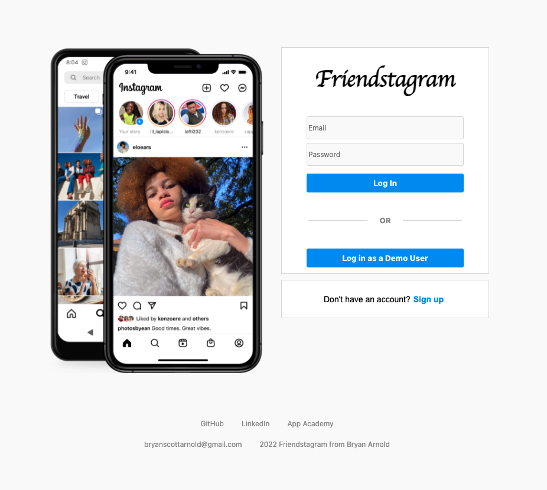
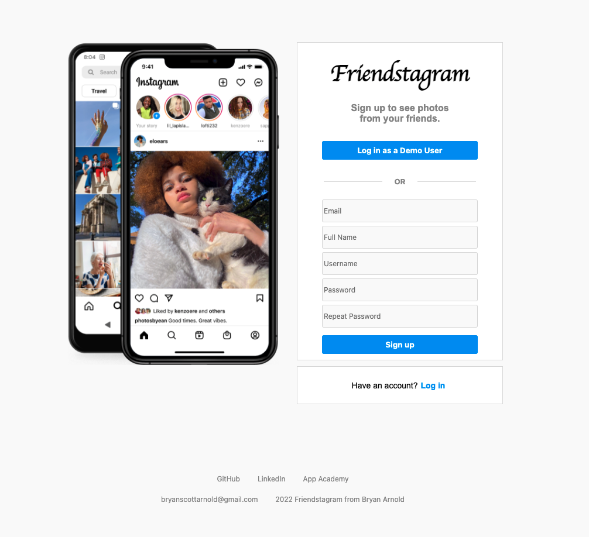
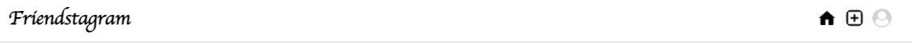
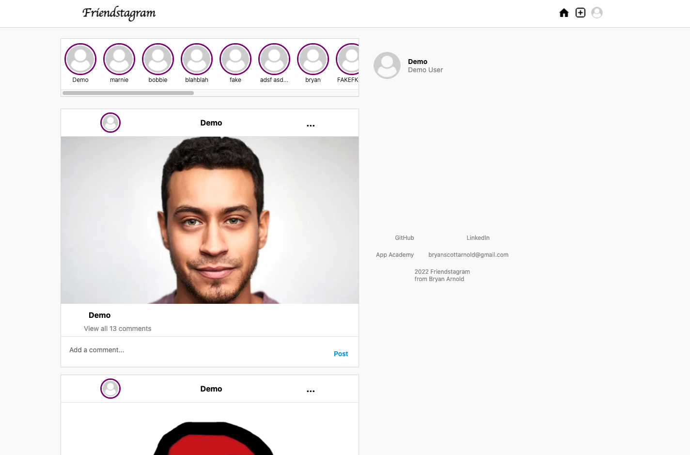
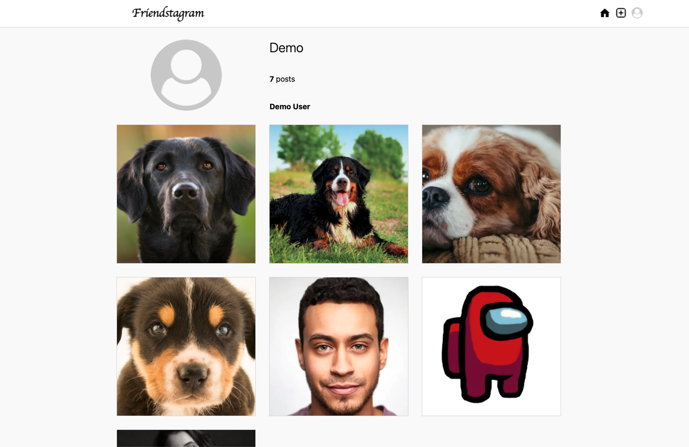
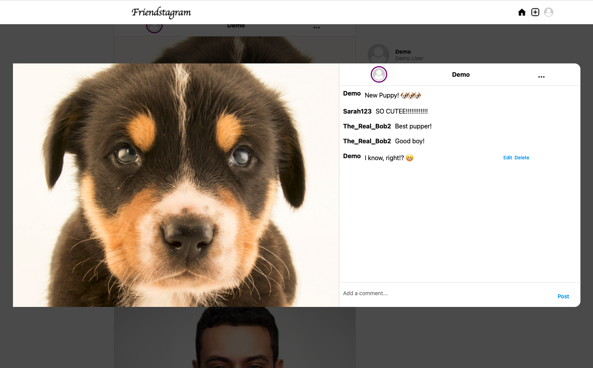
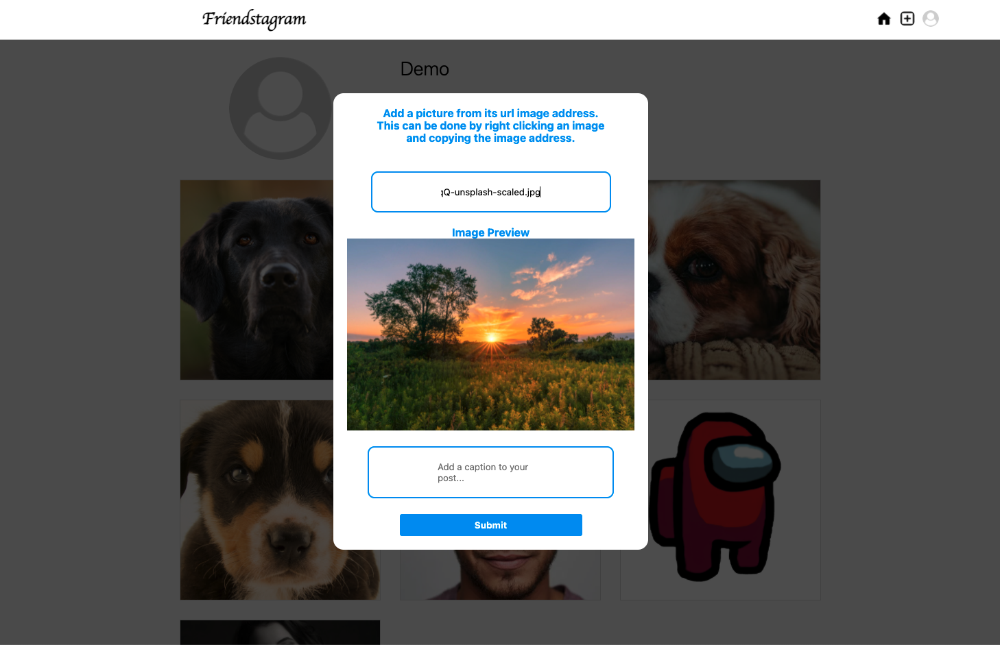

# Friendstagram

### Friendstagram is a clone of Instagram by Bryan Arnold

### The app currently featuring:

* Authenticated users
* Image posts
* Comment posts
* Home Page with all images
* Profile pages with all images by those users

### Soon to come to Friendstagram:
* Likes
* Followers
* Replies
* Comment and Reply Likes
* User information: including bios profile pictures
* The ability to update or delete your account
* Uploading photos from local storage
* And more...

### You can visit the live website at

```sh
https://friendsta-gram.herokuapp.com/
```

### Once the "Log in" page, you can:

* Click "Log in as a Demo User" to tour and test the website without creating an account
* Enter log in information if you have previously created an account
* Be redirected to the "Sign up" page to create an account

### Once on the "Sign up" page, you can:
* Click "Log in as a Demo User" to tour and test the website without creating an account
* Enter account information, which will be checked against particular validation errors, and securely stored in a database
* After all user information passes validation, you can click "Sign up", which will log you in
* Be redirected to the "Log in" page if you already created an account


<div style='display:flex;flex-dirextion:row;'>
  <div style='display:grid'>
    <strong style='text-align:center;text-decoration:underline'>Log in page</strong>
    
  </div>
  <div style='display:grid'>
    <strong style='text-align:center;text-decoration:underline'>Sign up page</strong>
    
  </div>
</div>


### Once logged in, the "Nav Bar" will remain on the top of the window at all times,
### So if you are ever lost you will have access to:

* The Home Page by clicking on the Friendstagram logo or the Home icon.
* The "Plus" icon to add a new image
* The "User" icon to access a dropdown menu with the following:
   * Profile
   * Logout

<div style='display:flex;flex-dirextion:row;'>
  <div style='display:grid'>
    <strong style='text-align:center;text-decoration:underline'>Nav Bar</strong>
    
  </div>
</div>

### The "Home" page is a feed of the all post, with the most recent displaying first.

* On the top of the page, there will be a list of all users, which can be clicked to navigate to said user's "Profile Page."
* Below will be the feed of all images, each of which contains:
  * The uploader's profile image and username 
    * If you uploaded an image, this area will also contain an options button (...)
      * This will present a modal to "Edit" or "Delete" the image and caption or "Delete" the image and all associated comments
  * The image itself
  * The image's optional caption
  * The singular comment on the image, or a clickable 'View all # comments' button
    * if you have added a comment and you wish to edit or delete it, you can:
      * Click "Edit" which will pop-up a modal to edit your comment
      * Click "Delete" which will pop-up a modal having you to confirm your deletion
  * The "Add a comment..." field with "Post" button
* To the right of the feed is:
  * The current user information , which contains:
    * A clickable profile image
    * The user name of the current user
    * The full name of the current user
  * The creator of Friendstagram's information (which is also displayed as a footer on every page)

<div style='display:flex;flex-dirextion:row;'>
  <div style='display:grid'>
    <strong style='text-align:center;text-decoration:underline'>Home Page</strong>
    
  </div>
</div>

### The "Profile" page is a list of all uploads by a particular user.

* The top of the page will contain the user's username, the number of posts by said user, and the user's full name
* The rest of the page will contain a grid of squares displaying of all of the posts by the user, by most recent
* Each image is clickable to view the full image, it's caption, and comments made on that image

<div style='display:flex;flex-dirextion:row;'>
  <div style='display:grid'>
    <strong style='text-align:center;text-decoration:underline'>Profile Page</strong>
    
  </div>
</div>

### The "View" modal is accessable by clicking photos on the "Profile" page or by clicking "View all # comments on the "Home" page
* On the left, the image will display at it's largest possible size
* On the right:
  * The uploader's clickable profile image, the uploader's clickable name, and an option's button (...) if uploaded by the current user
  * The uploader's name and the image's caption, followed by all comments on the image
  * An "Add a comment..." field with a "Post" button
<div style='display:flex;flex-dirextion:row;'>
  <div style='display:grid'>
    <strong style='text-align:center;text-decoration:underline'>View Modal</strong>
    
  </div>
</div>

### And last but not least, the "Add Post" modal, which is accessible by the add button (+) in the Nav Bar
### Note: the "Edit Post" modal, accessible through the options button (...), works virtually the same

* This modal will contain:
  * Instructions on how to add an image
  * A field to type or paste an image address
  * A preview of the image that will be uploaded
  * A caption field
  * The "Submit" button
* To add a post, the image address must:
  * Come from a valid url (begginning with http:// or https://)
  * End with a valid image file extension (.jpg, .jpeg, .png, .gif, or .bmp)
* If an image is uploaded, but the image cannot be found, a "Not Found" image will display in it's place

<div style='display:flex;flex-dirextion:row;'>
  <div style='display:grid'>
    <strong style='text-align:center;text-decoration:underline'>Add Post Modal</strong>
    
  </div>
</div>

### And that is all currently for Friendstagram, but more soon to come!
### Feel free to test it out all you like
### To log out, click the "User" icon on the Nav Bar to access the "Log out" button

### Contact me for any job offers

Bryan Arnold
bryanscottarnold@gmail.com

LinkedIn: 'https://www.linkedin.com/in/bryan-arnold-882378215/'
GitHub: https://github.com/B-S-Arnold


Live Site Hosted on Heroku: https://friendsta-gram.herokuapp.com/

This project was made in 2022 as a part of the App Academy curriculum

https://www.appacademy.io/

2022 Friendstagram by Bryan Arnold

# Thank you for using Friendstagram!

### Technologies used

* Javascript and React (frontend)
* Python and Flask (backend)
* HTML and CSS (layout and styling)
* Docker and Heroku (deploying and hosting online)


## Steps to run this app

### 1. Clone this repo

```sh
https://github.com/B-S-Arnold/Friendstagram
```
### 2. Install the dependencies from the root directory

```sh
pipenv install --dev -r dev-requirements.txt && pipenv install -r requirements.txt
```

### 3. Create a POSTGRESQL user with CREATEDB and PASSWORD in PSQL

```sh
CREATE USER <name> WITH CREATEDB PASSWORD <'password'>;
```
* NOTE: remeber this information, as you will be using it in step 5

### 4. Create a POSTGRESQL database WITH OWNER as the user you created 

```sh
CREATE DATABASE <dbname> WITH OWNER <name>;
```

### 5. Create a .env file in the backend directory based on the .env.example found wihtin said directory

### 6. Enter your username and password information in your .env file along with a secure set of (random) characters for your SECRET_KEY

### 7. Open the Python shell

```sh
pipenv shell
```
### 8. Upgrade and seed the database
* NOTE - if at any moment, you wish to undo seeds and migrations perform the following:

```sh
 flask db upgrade
```

```sh
flask seed all
```

### 8. Run flask from within the shell in the root directory

```sh
flask run
```

### 9. Open up a second terminal and CD into react-app. Start npm services, which should open in the browser

```sh
npm start
```

* if the browser does not automatically open, navigate to http://localhost:3000


## Thanks again for using Friendstagram!

## Contact info:

Bryan Arnold
bryanscottarnold@gmail.com

LinkedIn: 'https://www.linkedin.com/in/bryan-arnold-882378215/'
GitHub: https://github.com/B-S-Arnold

Live Site Hosted on Heroku: https://friendsta-gram.herokuapp.com/

This project was made in 2022 as a part of the App Academy curriculum

https://www.appacademy.io/

2022 Friendstagram by Bryan Arnold